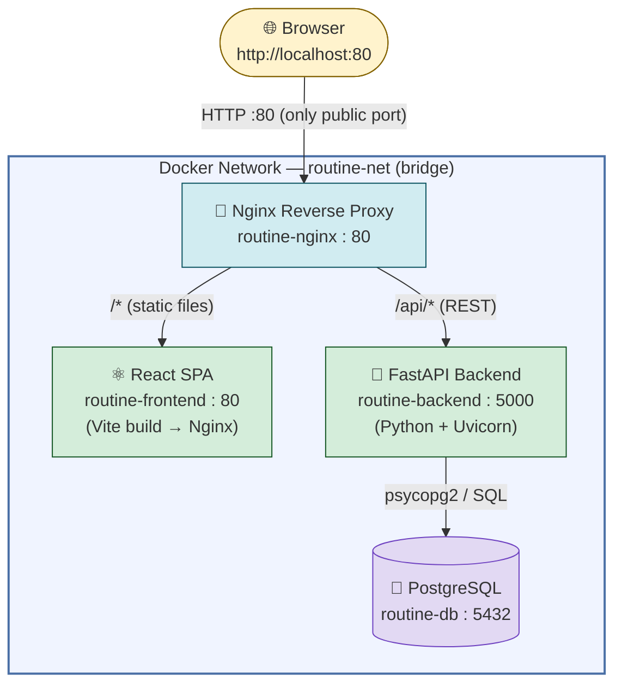
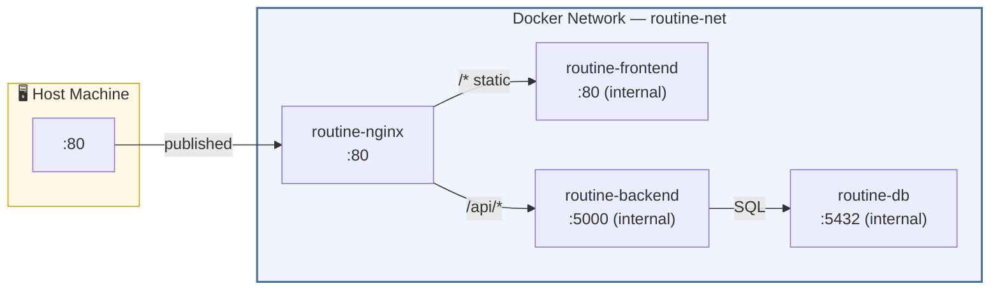
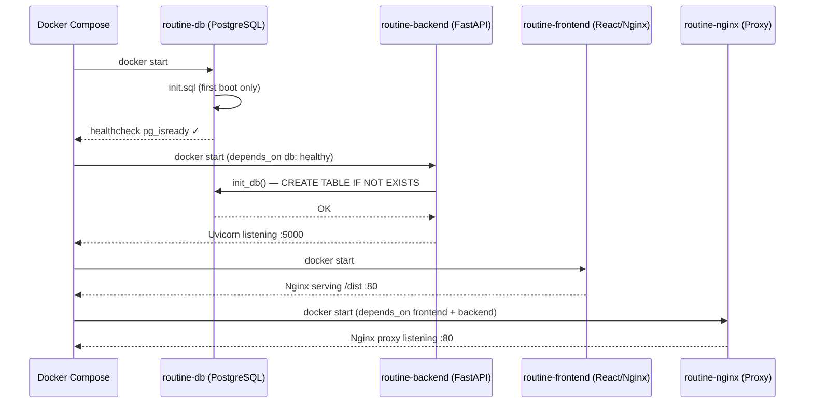
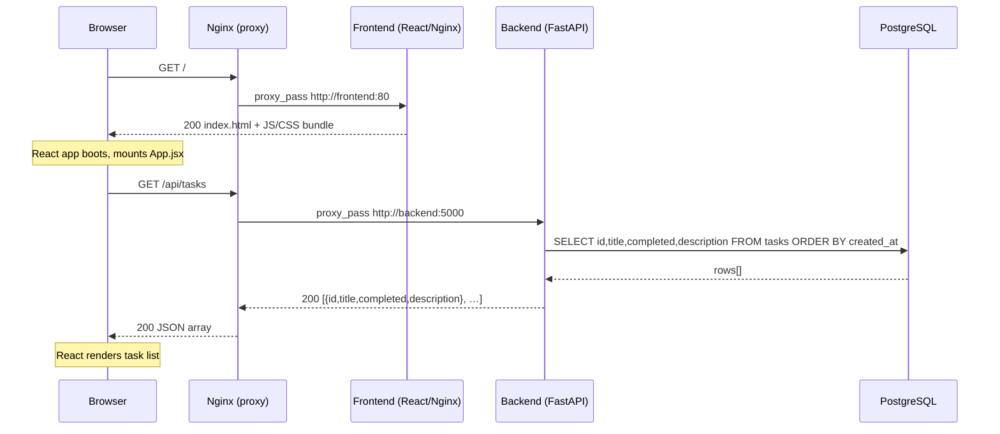
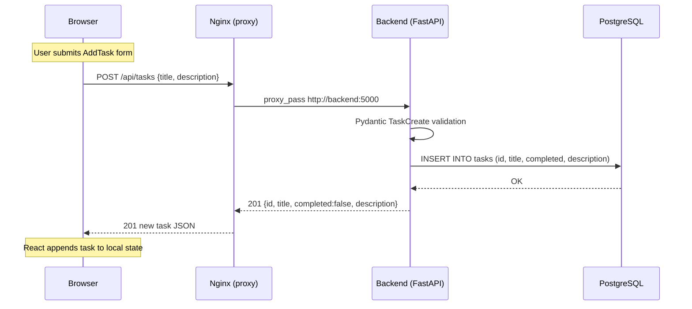
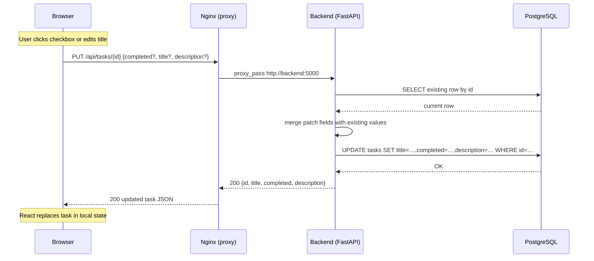
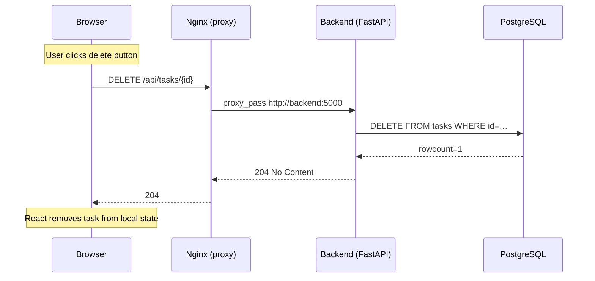

# Task Tracker App

A fully-containerised task-management application built with a four-container architecture: a React SPA, a FastAPI backend, a PostgreSQL database, and an Nginx reverse proxy — all orchestrated with Docker Compose.

---

## Architecture Overview



| Container           | Technology                  | Exposed internally | Host port |
|---------------------|-----------------------------|--------------------|-----------|
| `routine-nginx`     | Nginx (reverse proxy)       | 80                 | **80**    |
| `routine-frontend`  | React 18 + Vite → Nginx     | 80                 | —         |
| `routine-backend`   | Python 3 + FastAPI + Uvicorn| 5000               | —         |
| `routine-db`        | PostgreSQL 15               | 5432               | —         |

> Only `routine-nginx` publishes a port to the host. Every other service is reachable only within the shared `routine-net` bridge network.

---

## Docker Networking

### The `routine-net` Bridge Network

All four containers join a single user-defined bridge network called `routine-net` (declared in `docker-compose.yml`). Docker's embedded DNS resolver gives each container a DNS name that matches its **service name** — so containers call each other by name, not by IP:

| Caller            | Target DNS name | Port |
|-------------------|-----------------|------|
| `routine-nginx`   | `frontend`      | 80   |
| `routine-nginx`   | `backend`       | 5000 |
| `routine-backend` | `db`            | 5432 |

### Why a user-defined bridge (not the default)?

- **Automatic DNS resolution** — containers resolve each other by service name.
- **Isolation** — the network is invisible to containers outside this Compose project.
- **No unwanted exposure** — `backend`, `frontend`, and `db` have no `ports:` mapping; they cannot be reached from the host machine directly.

### Port exposure rules



> `backend`, `frontend`, and `db` use `expose:` (not `ports:`), so they are **unreachable from outside Docker** — traffic must flow through Nginx.

---

## Service-by-Service Breakdown

### Container Startup Sequence



### 1. PostgreSQL (`db/`)

- **Image:** Custom image built from `db/Dockerfile` based on `postgres:15`.
- **Startup:** `db/init.sql` runs automatically on a **fresh** volume; it creates the `tasks` table. On subsequent starts the data directory already exists so the script is skipped — preventing data loss.
- **Persistence:** Data is stored in the named volume `postgres_data`. This volume survives `docker compose down` — use `docker compose down -v` to also delete the data.
- **Health check:** Docker waits for `pg_isready` to succeed before marking the service healthy. The backend's `depends_on: db: condition: service_healthy` ensures the API never starts before the database is ready to accept connections.
- **Credentials** (set as environment variables in `docker-compose.yml`):

  | Variable          | Value       |
  |-------------------|-------------|
  | `POSTGRES_DB`     | `tasksdb`   |
  | `POSTGRES_USER`   | `tasksuser` |
  | `POSTGRES_PASSWORD`| `taskspass`|

### 2. Backend (`backend/`)

- **Stack:** Python 3, FastAPI, Uvicorn, psycopg2.
- **Connection to DB:** Reads `POSTGRES_HOST`, `POSTGRES_PORT`, `POSTGRES_DB`, `POSTGRES_USER`, `POSTGRES_PASSWORD` from the environment. Docker Compose injects these so the backend dials `db:5432` (the service-name DNS entry on `routine-net`).
- **Startup retry:** `init_db()` retries the PostgreSQL connection for up to 30 seconds, sleeping 1 second between attempts. This is a safety net on top of the `service_healthy` condition.
- **Table initialisation:** On startup the backend runs `CREATE TABLE IF NOT EXISTS tasks (…)`, making it idempotent even if the DB already contains data.
- **No host port binding:** `expose: ["5000"]` makes the port reachable inside `routine-net` but not from the host.

### 3. Frontend (`frontend/`)

- **Stack:** React 18 + Vite 5 (development) → static files served by Nginx (production).
- **Multi-stage Docker build:**
  1. **Stage 1 (builder):** Node image runs `vite build`, producing optimised static assets in `/dist`.
  2. **Stage 2 (serve):** Nginx image copies only `/dist` — the final image contains no Node.js or source code.
- **API calls:** `src/api.js` sends all requests to the relative path `/api/tasks`. Because the URL is relative, it automatically goes to whatever origin served the page — i.e., `http://localhost/api/tasks` — which is caught by Nginx and proxied to the backend. **No hardcoded backend URL** exists in the frontend code.
- **No host port binding:** Only reachable via the proxy.

### 4. Nginx Reverse Proxy (`nginx/`)

- **Image:** Custom build from `nginx/Dockerfile`.
- **Single public entry point:** Binds `0.0.0.0:80` on the host and acts as the router for the entire application.
- **Routing logic** (`nginx/nginx.conf`):

  ```
  location /api  →  proxy_pass http://backend:5000
  location /     →  proxy_pass http://frontend:80
  ```

  Nginx forwards the original `Host`, `X-Real-IP`, and `X-Forwarded-For` headers so the backend can identify the true client IP if needed.
- **Upstream blocks:** Two named upstreams (`frontend` and `backend`) reference the Docker DNS names, keeping the config readable and easy to extend.

---

## Request / Response Flow

### Loading the page



### Creating a task



### Toggling / editing a task



### Deleting a task



---

## REST API Reference

Base URL (via proxy): `http://localhost/api`

| Method   | Endpoint          | Request body                             | Success response          | Description          |
|----------|-------------------|------------------------------------------|---------------------------|----------------------|
| `GET`    | `/api/health`     | —                                        | `200 {"status":"ok"}`     | Health check         |
| `GET`    | `/api/tasks`      | —                                        | `200 [Task, …]`           | List all tasks       |
| `POST`   | `/api/tasks`      | `{"title":"…", "description":"…"}`       | `201 Task`                | Create a task        |
| `PUT`    | `/api/tasks/{id}` | `{"title"?, "completed"?, "description"?}` | `200 Task`              | Update a task        |
| `DELETE` | `/api/tasks/{id}` | —                                        | `204 No Content`          | Delete a task        |

### Task schema

```json
{
  "id":          "550e8400-e29b-41d4-a716-446655440000",
  "title":       "Buy groceries",
  "description": "Milk, eggs, bread",
  "completed":   false
}
```

### cURL examples

```bash
# Health check
curl http://localhost/api/health

# List all tasks
curl http://localhost/api/tasks

# Create a task
curl -X POST http://localhost/api/tasks \
     -H "Content-Type: application/json" \
     -d '{"title": "Buy groceries", "description": "Milk, eggs, bread"}'

# Mark a task complete  (replace <id> with the UUID from the create response)
curl -X PUT http://localhost/api/tasks/<id> \
     -H "Content-Type: application/json" \
     -d '{"completed": true}'

# Delete a task
curl -X DELETE http://localhost/api/tasks/<id>
```

---

## Database Schema

```sql
CREATE TABLE IF NOT EXISTS tasks (
    id          TEXT        PRIMARY KEY,          -- UUID v4 generated by FastAPI
    title       TEXT        NOT NULL,
    completed   BOOLEAN     NOT NULL DEFAULT FALSE,
    description TEXT        NOT NULL DEFAULT '',
    created_at  TIMESTAMPTZ NOT NULL DEFAULT NOW() -- used for ORDER BY in GET /api/tasks
);
```

Tasks are returned ordered by `created_at` so the list is stable and insertion-ordered.

---

## Quick Start

```bash
# Build all images and start all four containers
docker compose up --build

# Open in browser
http://localhost
```

```bash
# Stop all containers (data is preserved in the postgres_data volume)
docker compose down

# Stop and delete all data
docker compose down -v
```

---

## Project Structure

```
Task_Tracker_App/
├── docker-compose.yml        # Service orchestration & network/volume declarations
├── architecture.md           # Detailed architecture reference
├── README.md
├── db/
│   ├── Dockerfile            # Extends postgres:15
│   └── init.sql              # Creates tasks table on first boot
├── backend/
│   ├── app.py                # FastAPI app, routes, DB helpers, Pydantic models
│   ├── requirements.txt      # fastapi, uvicorn, psycopg2-binary
│   └── Dockerfile
├── frontend/
│   ├── Dockerfile            # Multi-stage: Vite build → Nginx serve
│   ├── index.html
│   ├── package.json
│   ├── vite.config.js
│   └── src/
│       ├── main.jsx          # React entry point
│       ├── App.jsx           # Root component — state & filter management
│       ├── App.css / index.css
│       ├── api.js            # Thin fetch wrapper for /api/tasks
│       └── components/
│           ├── AddTask.jsx   # New-task form
│           ├── TaskList.jsx  # Filtered list renderer
│           └── TaskItem.jsx  # Single task row (toggle, edit, delete)
└── nginx/
    ├── nginx.conf            # Upstream blocks + location routing rules
    └── Dockerfile
```

---

## Local Development (without Docker)

Run the backend and frontend in separate terminals. Vite's dev proxy rewrites `/api` requests to the local FastAPI server, mirroring the production Nginx routing.

**Database** — you need a local PostgreSQL instance:
```bash
createdb tasksdb
```

**Backend**
```bash
cd backend
pip install -r requirements.txt
POSTGRES_HOST=localhost POSTGRES_DB=tasksdb \
POSTGRES_USER=<user> POSTGRES_PASSWORD=<pass> \
uvicorn app:app --reload --port 5000
```

**Frontend**
```bash
cd frontend
npm install
npm run dev        # Vite dev server on http://localhost:5173
                   # vite.config.js proxies /api → http://localhost:5000
```
