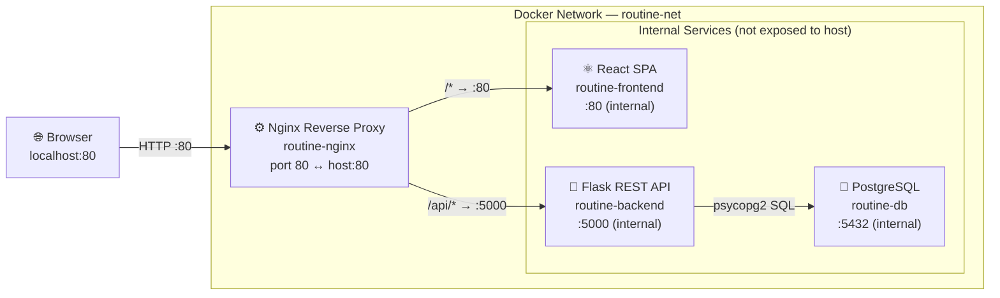

# Task Tracker App — Architecture

## Overview

A containerised three-tier web application composed of a React SPA, a Flask REST API, and an Nginx reverse proxy, all orchestrated with Docker Compose.

---

## System Diagram



---

## Services

### 1. Nginx (`nginx/`)
- **Image:** Built from `nginx/Dockerfile`
- **Public port:** `80:80` — the only port exposed to the host
- **Role:** Reverse proxy that routes traffic:
  - `GET|POST|PUT|DELETE /api/*` → Flask backend (`:5000`)
  - All other requests → React frontend (`:80`)
- **Config:** `nginx/nginx.conf`

### 2. Frontend (`frontend/`)
- **Stack:** React 18 + Vite 5
- **Image:** Multi-stage Docker build — Vite compiles the SPA, Nginx serves the static output
- **Exposed internally:** port `80` (not published to the host)
- **Key files:**

  | File | Purpose |
  |------|---------|
  | `src/main.jsx` | React entry point |
  | `src/App.jsx` | Root component — state management (tasks, filter, loading, error) |
  | `src/api.js` | HTTP client — wraps `fetch` calls to `/api/tasks` |
  | `src/components/AddTask.jsx` | Form for creating a new task |
  | `src/components/TaskList.jsx` | Filtered list renderer |
  | `src/components/TaskItem.jsx` | Single task row (toggle, edit, delete) |

### 3. Backend (`backend/`)
- **Stack:** Python 3 + Flask 3 + flask-cors
- **Image:** Built from `backend/Dockerfile`
- **Exposed internally:** port `5000` (not published to the host)
- **Database:** SQLite file at `DB_PATH` (default `/app/data/tasks.db`), auto-initialised on startup

---

## REST API

Base path: `/api`

| Method | Endpoint | Description |
|--------|----------|-------------|
| `GET` | `/api/health` | Health check — returns `{"status": "ok"}` |
| `GET` | `/api/tasks` | List all tasks (ordered by insertion) |
| `POST` | `/api/tasks` | Create a task — body: `{ title, description? }` |
| `PUT` | `/api/tasks/:id` | Update a task — body: `{ title?, completed?, description? }` |
| `DELETE` | `/api/tasks/:id` | Delete a task |

### Task Schema

```json
{
  "id":          "uuid-v4-string",
  "title":       "string (required)",
  "description": "string (default: \"\")",
  "completed":   false
}
```

---

## Data Layer

- **Engine:** SQLite (single-file, embedded)
- **Location:** Configured via `DB_PATH` environment variable → `/app/data/tasks.db`
- **Schema:**

  ```sql
  CREATE TABLE tasks (
      id          TEXT    PRIMARY KEY,
      title       TEXT    NOT NULL,
      completed   INTEGER NOT NULL DEFAULT 0,
      description TEXT    NOT NULL DEFAULT ''
  );
  ```

- **Migration:** On startup the backend attempts `ALTER TABLE tasks ADD COLUMN description` — silently ignored if the column already exists, making the migration idempotent.

---

## Docker Compose

File: `docker-compose.yml` (version `3.9`)

```
services
├── backend   (Flask API)
├── frontend  (React SPA)
└── nginx     (public reverse proxy)

networks
└── routine-net  (bridge)
```

All three services share the `routine-net` bridge network. Only `nginx` publishes a port to the host (`80:80`). `backend` and `frontend` are reachable only within the Docker network.

---

## Request Flow

1. Browser sends a request to `http://localhost:80`.
2. Nginx inspects the path:
   - Matches `/api` → proxies to `http://backend:5000`.
   - Anything else → proxies to `http://frontend:80`.
3. Flask handles API calls, reads/writes SQLite, and returns JSON.
4. React renders the UI; state changes trigger `fetch` calls to `/api/tasks`.

---

## Directory Structure

```
Task_Tracker_App/
├── docker-compose.yml      # Service orchestration
├── README.md
├── architecture.md         # This file
├── backend/
│   ├── app.py              # Flask application & routes
│   ├── Dockerfile
│   └── requirements.txt    # flask, flask-cors
├── frontend/
│   ├── Dockerfile          # Multi-stage: Vite build → Nginx serve
│   ├── index.html
│   ├── package.json
│   ├── vite.config.js
│   └── src/
│       ├── api.js
│       ├── App.jsx
│       ├── main.jsx
│       └── components/
│           ├── AddTask.jsx
│           ├── TaskItem.jsx
│           └── TaskList.jsx
└── nginx/
    ├── Dockerfile
    └── nginx.conf
```
