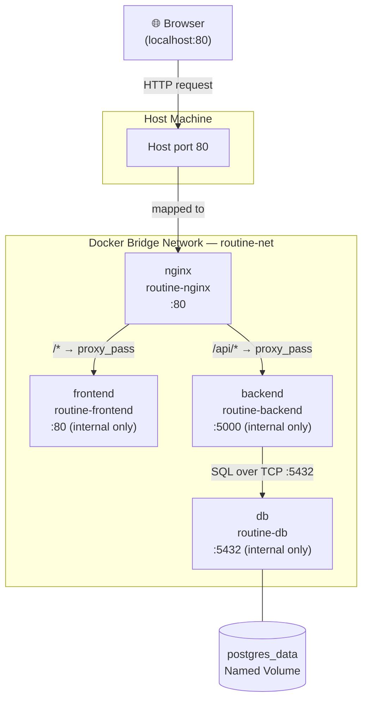
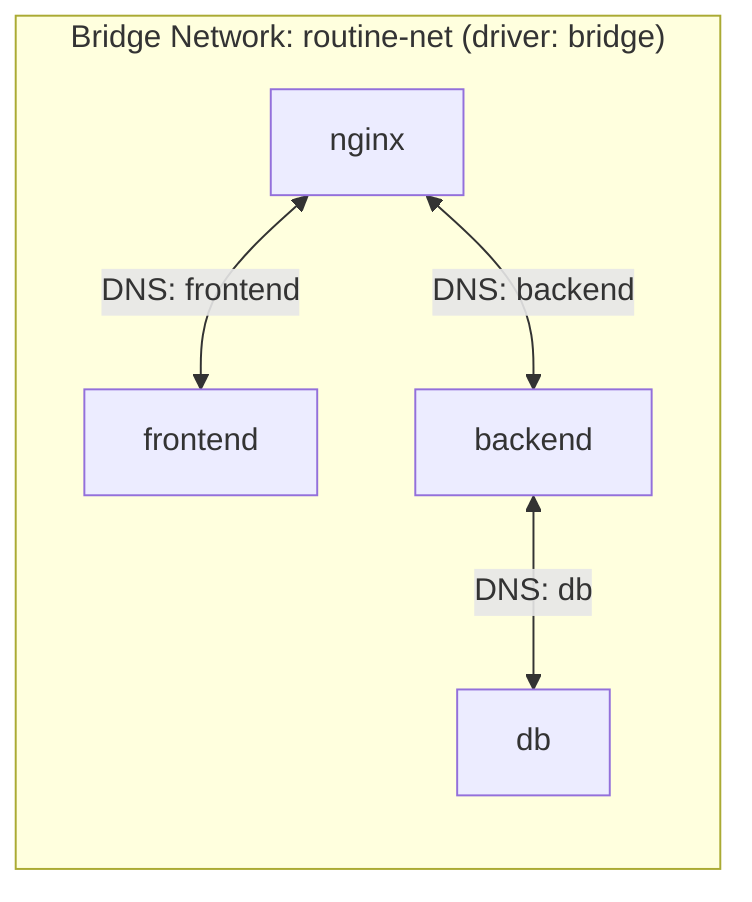
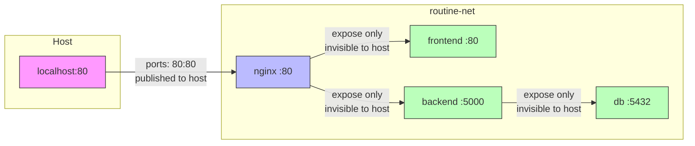
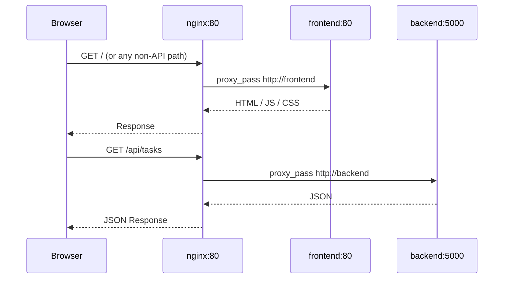
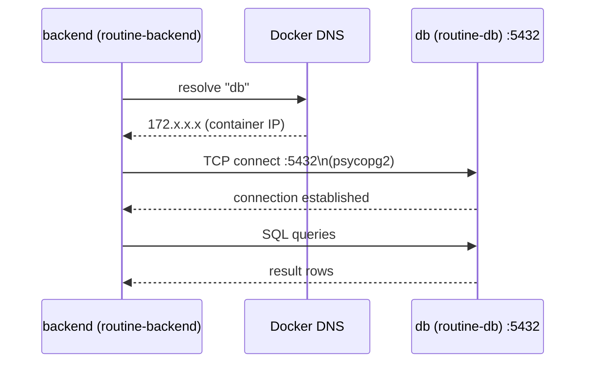
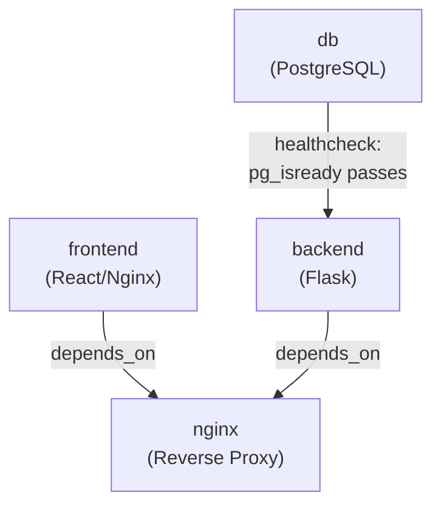
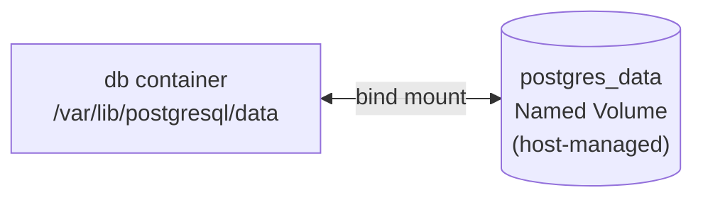
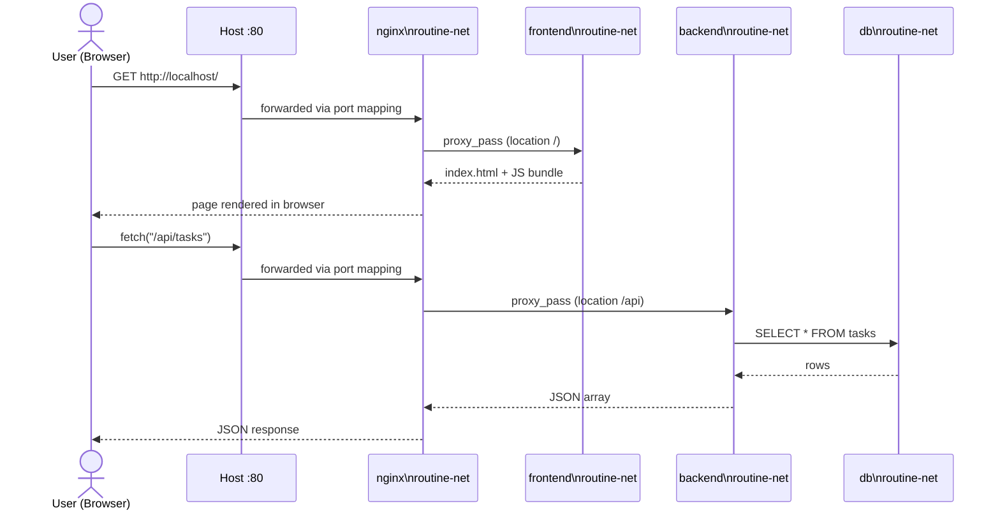

# Docker Networking — Task Tracker App

This document explains every networking decision made in this project: how containers find each other, which ports are exposed, how traffic flows, and why each choice was made.

---

## 1. High-Level Overview



**Key principle:** Only Nginx publishes a port to the host (`80:80`). Every other container lives exclusively inside the private `routine-net` bridge network and is unreachable from outside.

---

## 2. The Bridge Network — `routine-net`



**How it works:**

| Property | Detail |
|---|---|
| Driver | `bridge` — Docker's default software switch, isolated from the host network |
| Name | `routine-net` (defined once under `networks:` in `docker-compose.yml`) |
| DNS resolution | Docker embeds a DNS resolver; each service is reachable by its **service name** (e.g., `db`, `backend`, `frontend`) |
| Isolation | Containers NOT on `routine-net` cannot reach these services at all |

All four services attach to this single network:

```yaml
# docker-compose.yml (excerpt)
networks:
  routine-net:
    driver: bridge
```

Each service opts in with:
```yaml
networks:
  - routine-net
```

---

## 3. Port Strategy — `ports` vs `expose`



| Service | Directive | Ports | Visible outside Docker? |
|---|---|---|---|
| `nginx` | `ports: "80:80"` | Host 80 → Container 80 | **Yes** — the only public entry point |
| `frontend` | `expose: "80"` | Container 80 (internal) | No |
| `backend` | `expose: "5000"` | Container 5000 (internal) | No |
| `db` | *(neither)* | Container 5432 (internal) | No |

> `expose` is documentation-only metadata. It does **not** publish a port to the host; it signals to other containers (and `docker-compose`) that this port is in use.

---

## 4. Nginx — Reverse Proxy & Traffic Router

Nginx is the single public gateway. It uses **named upstreams** that resolve via Docker DNS:



**Routing rules from `nginx.conf`:**

```
location /api  →  proxy_pass http://backend   (Flask on :5000)
location /     →  proxy_pass http://frontend  (Vite/Nginx on :80)
```

Nginx also forwards important headers so the backend knows the real client:

```nginx
proxy_set_header Host              $host;
proxy_set_header X-Real-IP         $remote_addr;
proxy_set_header X-Forwarded-For   $proxy_add_x_forwarded_for;
proxy_set_header X-Forwarded-Proto $scheme;
```

---

## 5. Backend → Database Connection

The Flask backend connects to PostgreSQL using environment variables injected by Docker Compose:



**Environment variables that drive the connection:**

```yaml
# docker-compose.yml (backend service)
environment:
  - POSTGRES_HOST=db        # ← Docker DNS name of the db service
  - POSTGRES_PORT=5432
  - POSTGRES_DB=tasksdb
  - POSTGRES_USER=tasksuser
  - POSTGRES_PASSWORD=taskspass
```

The host name `db` works because both containers share `routine-net`. Docker's embedded DNS resolves the service name `db` to the container's internal IP automatically.

---

## 6. Service Startup & Dependency Order



| Dependency | Mechanism | Why |
|---|---|---|
| `backend` waits for `db` | `depends_on` with `condition: service_healthy` | Prevents Flask from crashing on startup because Postgres isn't ready yet |
| `nginx` waits for `frontend` & `backend` | `depends_on` (service started) | Ensures upstream targets exist before Nginx begins accepting traffic |

The `db` healthcheck uses `pg_isready`:
```yaml
healthcheck:
  test: ["CMD-SHELL", "pg_isready -U tasksuser -d tasksdb"]
  interval: 5s
  timeout: 5s
  retries: 10
```

---

## 7. Persistent Storage — Named Volume



The volume is declared outside any service so it persists across `docker compose down / up` cycles:

```yaml
volumes:
  postgres_data:   # top-level — not tied to container lifecycle
```

Mounted inside the `db` service:
```yaml
volumes:
  - postgres_data:/var/lib/postgresql/data
```

This is **not** a networking concern, but it affects availability: the database survives container recreation, so the backend always finds its data intact on reconnect.

---

## 8. Complete Request Lifecycle



---

## 9. Summary Table

| Container | Network | Published Port | Internal Port | Communicates With |
|---|---|---|---|---|
| `routine-nginx` | `routine-net` | **80** (host) | 80 | `frontend`, `backend` |
| `routine-frontend` | `routine-net` | none | 80 | — |
| `routine-backend` | `routine-net` | none | 5000 | `db` |
| `routine-db` | `routine-net` | none | 5432 | — |
